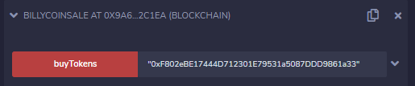
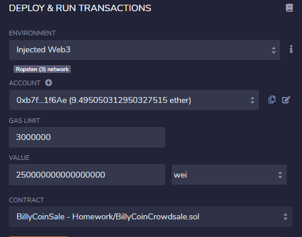
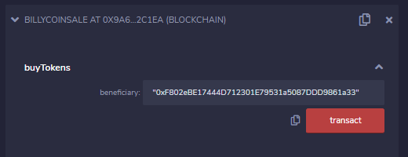
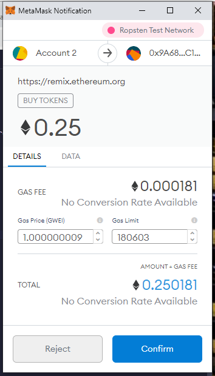
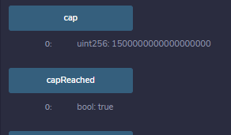
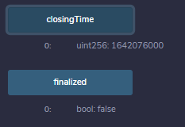
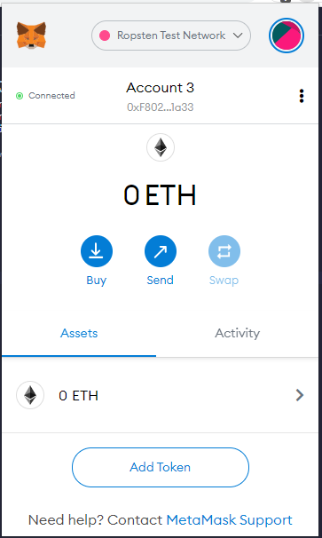

# crowdsale_homework

Gas Used 4774072 to execute Contract

Ropsten Network

Deployer Contract 0xf76dDD0dBeF79CB5D32a42a8758A56550373f51a

Token Address 0x099e7bf77189ec171217Fa368cc4578594780053

Token Sale Address 0x9A68018745732bCDEDd703Cf272f5428A692C1ea

goal 1.5 ETH (1500000000000000000 Wei)

Exchange Rate 10 to 1 ETH

Decimals 18

## How to purchase Billy Coin via Crowdsale

### 1.  Interact with Billycoinsale smart contract and use buyTokens.

### 2.  Select your Account and set value.

### 3.  Expand buyTokens, paste beneficiary address, and click on transact.

**Confirm the transaction in Metamask to get it on the blockchain.**

**These are the 3 transactions to complete the goal of the crowdsale. (1.5 ETH total)**

0.25 ETH for **0xF802eBE17444D712301E79531a5087DDD9861a33**

[hash 0x3d1a9e71accd81e32ddf7a5d1ab88069fb79db355d09a330e7c522179a930ab1](https://ropsten.etherscan.io/tx/0x3d1a9e71accd81e32ddf7a5d1ab88069fb79db355d09a330e7c522179a930ab1)

0.75 ETH for **0xDa40C17CCE8539d1236D353b13317F0B2709EB42** 

[hash 0x01c20adceca23932b5b41760e48ff842d477cd0697308719840d9684adc8ac0f](https://ropsten.etherscan.io/tx/0x01c20adceca23932b5b41760e48ff842d477cd0697308719840d9684adc8ac0f)

0.50 ETH for **0x3662553f4A22442D74D460dCd55351DbfB53066A**

[hash 0x8db7b6eff1a28a15f49c4a65f476e6014bac12ad9b0042ffc88f048e6d826ed1](https://ropsten.etherscan.io/tx/0x8db7b6eff1a28a15f49c4a65f476e6014bac12ad9b0042ffc88f048e6d826ed1)

### 4.  Confirm we reached the goal of 1.5 ETH.

### 5.  We can not finalize the crowdsale until 24 weeks have passed.

## How to add token to Metamask

### 1. Open Metamask and click on Assets

### 2. Click on Add Token and fill in with token address. (0x099e7bf77189ec171217Fa368cc4578594780053)

### 3. This is how it would look in the wallet.  When crowdsale ends and tokens are withdrawn you will see the balance of your new asset.

